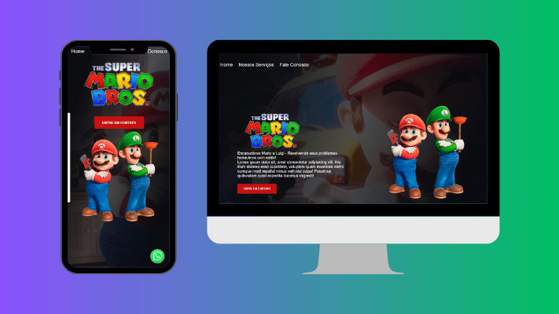

# Mario Brothers

   
   
   
   
   

 

> Esse projeto é um site dos irmãos Mario e Luigi, este site deve incluir as formas de contato com os irmãos.
>
> ### Ajustes e melhorias

O projeto já esta finalizado.

- [x] Preparar código HTML
- [x] Estilizar com CSS
- [x] Fazer forms
- [x] Usar JS para animar
- [x] Aplicar responsividade

## 💻 Pré-requisitos

Antes de começar, verifique se você atendeu aos seguintes requisitos:

- Você instalou a versão mais recente de `<HTML, CSS e JS>`.
- Você tem uma máquina `<Windows / Linux / Mac>`.

## 📫 Contribuindo para Mario-Brothers

Para contribuir com Mario-Brothers, siga estas etapas:

1. Bifurque este repositório.
2. Crie um branch: `git checkout -b <nome_branch>`.
3. Faça suas alterações e confirme-as: `git commit -m '<mensagem_commit>'`
4. Envie para o branch original: `git push origin <nome_do_projeto> / <local>`
5. Crie a solicitação de pull.

Como alternativa, consulte a documentação do GitHub em [como criar uma solicitação pull](https://help.github.com/en/github/collaborating-with-issues-and-pull-requests/creating-a-pull-request).
